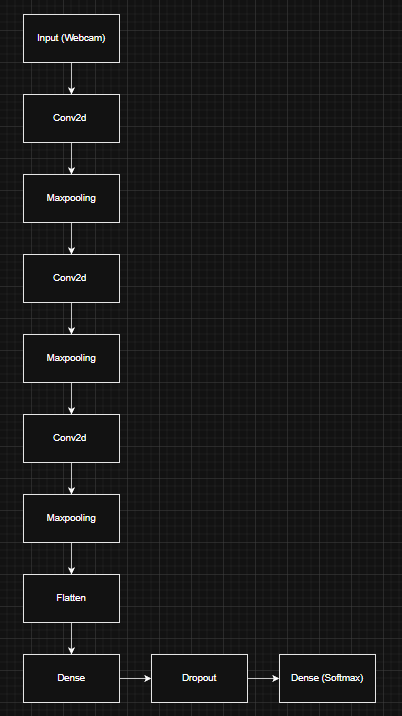
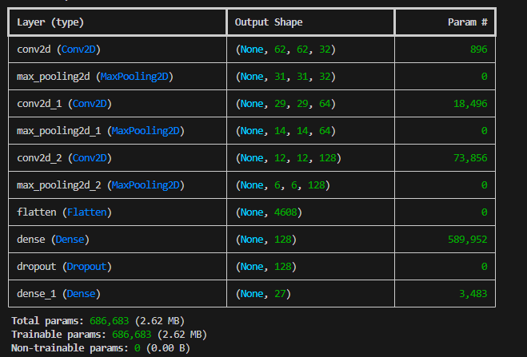
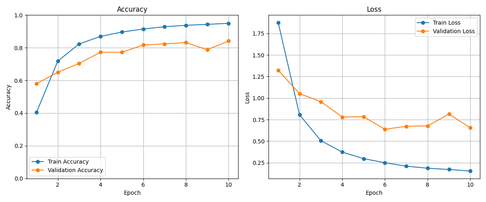

# [Project Title: ASL Sign Recognition Using Real-Time Computer Vision]
**CSC173 Intelligent Systems Final Project**  
*Mindanao State University - Iligan Institute of Technology*  
**Student:** [Joseph Jr. Q. Corpuz], [2020-1360]  
**Semester:** [e.g., AY 2025-2026 Sem 1]  
[](https://python.org) []
## Abstract
[This project aims to develop an ASL Recognition Software using Computer vision. Using a convolutional lightweight neural network (CNN). The system defines hand gestures into its corresponding letters from A-Z as well as class "nothing". All of this is done through a live webcam input. Using the publicly available ASL Alphabet Dataset, which has 87,000 images, 3000 per class, a custom CNN with 3 convolutional blocks followed by a dense layer with dropout wasa trained from scratch. Data augmentation techniques is also introduce such as rotation, shifts, zooms and flips to improve generalization. The trained model achieves a validation accuracy exceeding 70% and can predict ASL letters in real-time displating the class and confidence on the video feed. This tool is meant to assist beginners and educators in learning ASL in real time and providing a foundation for future extensions.][web:25][web:41]

## Table of Contents
- [Introduction](#introduction)
- [Related Work](#related-work)
- [Methodology](#methodology)
- [Experiments & Results](#experiments--results)
- [Discussion](#discussion)
- [Ethical Considerations](#ethical-considerations)
- [Conclusion](#conclusion)
- [Installation](#installation)
- [References](#references)

## Introduction
### Problem Statement
[Learning ASL can be a bit challenging, especially if you are learning solo. Due to the lack of interactive tools, feedback is often lacking in solo learning. A computer vision system capable of recognizing ASL sign Letters in real-time can help with solo learning, especally users with disabilities, and it could even assist educators]

### Objectives
- [Objective 1: Develop and train a lightweight CNN model to classify ASL hand signs for letters A-Z and a "nothing" class ]
- [Objective 2: Achieve At least ≥85% validation accuracy on a test set.]
- [Objective 3: Implement the pipeline : data loading -> Preprocessing -> Training -> Evaluation -> Real time inference using webcam.]


## Related Work
- [Paper 1:Sign Language Recognition System using Convolutional Neural Network and Computer Vision. ]
- [Paper 2:Real-time computer vision-based Bengali Sign Language recognition. 2014 17th International Conference on Computer and Information Technology (ICCIT).]
- [Gap: Simple and lightweight ASL Recognition application, better than other similar studies in low resource educational settings.] [web:25]

## Methodology
### Dataset
- Source: [https://www.kaggle.com/datasets/grassknoted/asl-alphabet?spm=a2ty_o01.29997173.0.0.4d3b5171SWqFym]
- Split: 80/20 train/val (custom test)
- Preprocessing: Resizing to 64x64, rescaling pixels to [0,1], random rotations, shifts, zooms, and horizontal flips [web:41]

### Architecture


- Custom CNN with three convolutional blocks (Conv → ReLU → MaxPool)    
- Fully connected layer with 128 neurons, followed by 50% dropout
- Output layer: 27 neurons with softmax activation

| Parameters| Value |
|-----------|-------|
| Batch Size | 32 |
| Learning Rate | 0.001 |
| Epochs | 10 |
| Optimizer | Adam |

### Training Code Snippet

```python

#Simple CNN Model
model = models.Sequential([
    layers.Conv2D(32, (3, 3), activation="relu", input_shape=(IMG_SIZE, IMG_SIZE, 3)),
    layers.MaxPooling2D(2, 2),

    layers.Conv2D(64, (3, 3), activation="relu"),
    layers.MaxPooling2D(2, 2),

    layers.Conv2D(128, (3, 3), activation="relu"),
    layers.MaxPooling2D(2, 2),

    layers.Flatten(),
    layers.Dense(128, activation="relu"),
    layers.Dropout(0.5),
    layers.Dense(NUM_CLASSES, activation="softmax")
])


#Train the model
history = model.fit(
    train_generator,
    epochs=EPOCHS,
    validation_data=val_generator,
)

#Compile the model
model.compile(
    optimizer="adam",
    loss="categorical_crossentropy",
    metrics=["accuracy"]
)


```

## Experiments & Results
### Metrics
| Model | Train Accuracy| Val Accuracy | Loss |
|-------|---------|-----------|--------|
| Custom CNN | 0.7188 | 0.6359 | 0.79 |

| Test | Accuracy | Loss |
|-------|---------|-----------|--------|
| Test dataset | 1.0000 | 0.0142 |



### Demo

[Video: [CSC173_YourLastName_Final.mp4](demo/CSC173_YourLastName_Final.mp4)] [web:41]

## Discussion
- Strengths: [Lightweight, CPU-friendly, works in real-time]
- Limitations: [Sensitive to hand orientation and lighting, may misclassify certain letters]
- Insights: [Data augmentation helped improve the model compared to earlier versions where it would be confident that it is this certain letter and is wrong] [web:25]

## Ethical Considerations
- Bias: Dataset primarily contains images with plain backgrounds and some with dark lighting, upon where it would often fail to recognized the ASL letter possibly due to lighting and hand position
- Privacy: No personally identifiable data included
- Misuse: Intended for educational and communication purposes. Not a medical tool [web:41]

## Conclusion
[The project successfully implemented a real-time ASL recognition system that can classify 27 classes with reasonable accuracy on a CPU. The test set resulted in a 100 percent accuracy due to it beaing a small dataset. Future directions include improving accuracy with more diverse datasets, implementing hand detection for better cropping, and deploying on mobile or embedded devices.]

## Installation
1. Clone repo: `git clone https://github.com/MeatiusMax/CSC173-DeepCV-Corpuz`
2. Install deps: `pip install -r requirements.txt`
3. Run Real-time_asl.py

**requirements.txt:**
absl-py==2.3.1
astunparse==1.6.3
certifi==2025.11.12
charset-normalizer==3.4.4
flatbuffers==25.12.19
gast==0.7.0
google-pasta==0.2.0
grpcio==1.76.0
h5py==3.15.1
idna==3.11
keras==3.13.0
libclang==18.1.1
Markdown==3.10
markdown-it-py==4.0.0
MarkupSafe==3.0.3
mdurl==0.1.2
ml_dtypes==0.5.4
namex==0.1.0
numpy==2.2.6
opencv-python==4.12.0.88
opt_einsum==3.4.0
optree==0.18.0
packaging==25.0
pillow==12.0.0
protobuf==6.33.2
Pygments==2.19.2
requests==2.32.5
rich==14.2.0
setuptools==80.9.0
six==1.17.0
tensorboard==2.20.0
tensorboard-data-server==0.7.2
tensorflow==2.20.0
termcolor==3.2.0
typing_extensions==4.15.0
urllib3==2.6.2
Werkzeug==3.1.4
wheel==0.45.1
wrapt==2.0.1


## References
[1] Hurroo, M. and Elham, M. (2020). Sign Language Recognition System using Convolutional Neural Network and Computer Vision. undefined, 9. 
[2]  Rahaman, M. A., Jasim, M., Ali, M. & Hasanuzzaman, M. (2014). Real-time computer vision-based Bengali Sign Language recognition. 2014 17th International Conference on Computer and Information Technology (ICCIT). [web:25]

## GitHub Pages
View this project site: [https://github.com/MeatiusMax/CSC173-DeepCV-Corpuz](https://github.com/MeatiusMax/CSC173-DeepCV-Corpuz/) [web:32]